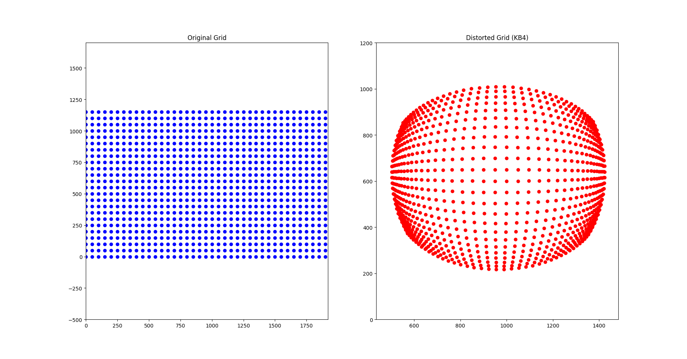

I choose KB4 model to analyze how fisheye camera system work. The parameter is given as [fx, fy, cu, cv, k1, k2, k3, k4] = [622, 622, 965, 631, -0.256, -0.0015, 0.0007, -0.0002] 

which 
fx,fy: is focal lengths  which is the scale of the image along the axis.In the given parameter set they are equal mean that the horizontal and vertical 
scales are the same

cu,cv: principal point's which is where the optical axis intersects the image sensor ideally it should be 0

k1, k2, k3, k4: radial distortion coefficients which causes straight lines to appear curve. 

## Tought Process

First I converts pixel coordinates to a normalized space where the origin (0,0) by using 
    x_norm = (x - cu) / fx
    y_norm = (y - cv) / fy

Then I Calculating Radial Distance using

    r2 = x_norm**2 + y_norm**2
    r4 = r2**2
    r6 = r4 * r2

After that I apply distortion model by using equation '1 + k1 * r2 + k2 * r4 + k3 * r6 + k4 * r4 * r2' based on above Radial Distance

After calculating the distortion factor the script apply it to the normalized coordinates then scales them back to pixel dimensions using the focal lengths and repositions them according to the principal point.

Last I visualize by applying the model using quiver plot

## Experiment
I begin an experiment by adjusting the value of [fx, fy, cu, cv, k1, k2, k3, k4]

when I decrease fx fy the field of view(fov) image will look more distort but if I increase fx fy image will look less distort because the pixels are stretched out.

when I adjust cu cv the distortion will shift to the left and right of the frame.

Now for radial distortion coefficients 

when I adjust k1 to postive value  the distortion will be barrel (outward) instead of pincushion (inward). 

when I adjust k2 the distortion effect will be more intense or less intense

when I adjust k3 the distortion effect strenght around outer of the frame will change

and lastly when I adjust k4 if I increse the distorion at the around the edge of frame will go more outward and if decrease the distorion at the around the edge of frame will go more inward

By fine-tuning these parameters, I able to understand more about camera calibration to achieve the desired image representation. This experiment show the complexity of lens distortion correction, particularly for wide-angle fisheye lense.

